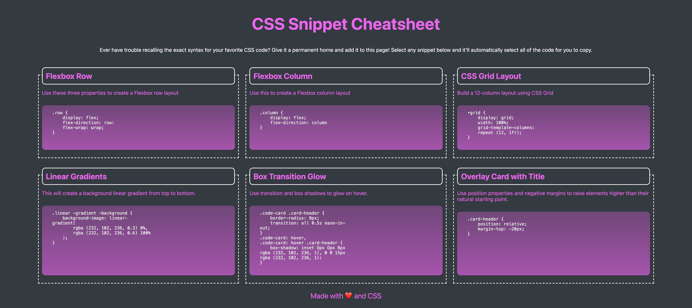

# wire-framing-grid-practice

## Description
Creating a CSS wire-frame using Grids to practice and understand Grids

## Summary of Changes
- Created the CSS Wireframe to have 3 columns and 2 rows with different elements embedded inside. 

## License
Licensed under the MIT License

## GitHub Repository
URL: https://github.com/adebayoadebisi/wire-framing-grid-practice 

## Deployed Web Application
URL: https://adebayoadebisi.github.io/01-code-refactor-challenge/ 